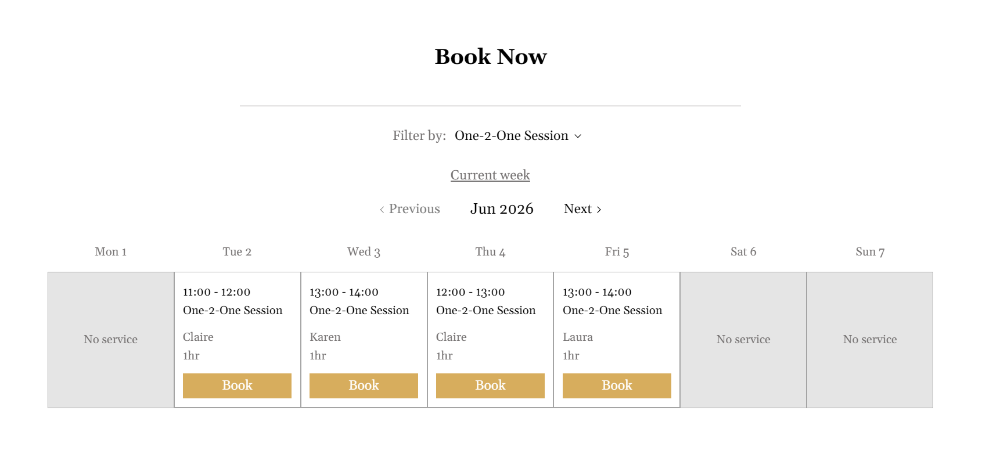
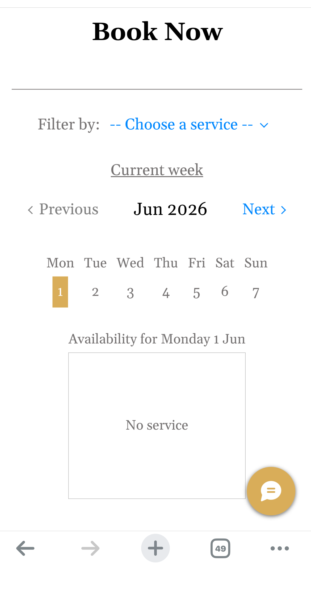
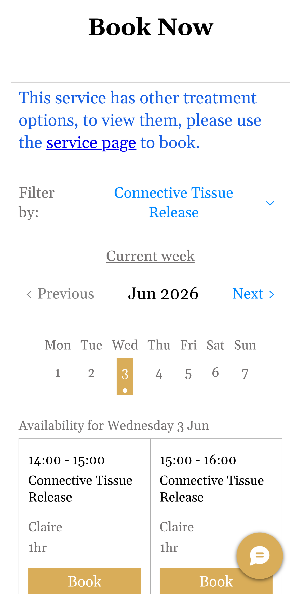

### [Live App is here](https://www.blueskypilates.co.uk/?rc=test-site)

This component is developed for a business website. It allows customers to view available slots for any service and book directly. It complements the platform whose native calendars do not support multi-service slot queries.

Two sets of display solutions are provided for mobiles and larger screens respectively (see screenshots at the bottom).

## What Each File Does

There are two files in this project: 

1) `wixHome.js` - front-end code, executed upon initialisation of the website's home page.
2) `embeddedCode.html` - runs in a sandboxed iFrame with id="embedCal" (which means embedded calendar) on home page. This iFrame component will be referred to as `#embedCal`.

### wixHome.js

The flow within the code is composed of 3 steps (though 4 steps were written in the comments in this file, they are essentially 3 steps): 

1) Fetch all services from the platform API, and pass them to `#embedCal` upon page initialisation.
2) Listen to `#embedCal` for service selection events. Once a service is chosen, fetch its available slots and other relevant information (e.g. staff list, service variants) from the API, then pass the data to `#embedCal`.
3) Listen to `#embedCal` for booking actions. If a customer books a slot, use the slot information as query parameters to construct a URL and redirect to it. From there, the platform can take over the job, identify which slot it is, handle customer information collection, slot validity verification, and payment.

### embeddedCode.html

This file is responsible for rendering dropdown menu, calendar, slots, and any error message, depending on the data passed from `wixHome.js`. A regular flow looks like this:

1) Listen to the parent window (where `wixHome.js` runs) for the full service list. Populate the dropdown menu accordingly.
2) When a service is selected, post a message to the parent window, requesting available slots for it.
3) Listen to the parent window for the available slots, and render them once the data arrives.
4) When a slot is booked, post a message to the parent window providing its information.

## Cross-window Communication Protocol

The parent window and `#embedCal` communicate via `window.postMessage()`. This method supports transmission of a wide variety of data objects. The data objects used in this programme follow the structure below:

```
{
  type: <type_of_this_message>, // the determinant of the protocol
  data: <actual data>
}
```
An example of the actual data object being passed: 
```
{
  type: 'REQ_BOOK_CLS',
  data: {
    serviceId: serviceId,
    startDate: startDate,
    endDate: endDate,
    timeZone: "Europe/London",
  }
}
```

### Types Used By Parent Window 

| Types           | Explanations    | Notes    |
| -------------   | ------------- | --- |
| `SET_SERVICES`  | To pass the complete service list to `#embedCal` |  |
| `SET_APPO_SLOTS`| To pass the available slots to `#embedCal` when the service category is "Appointment" (category defined by the platform) |  |
| `SET_CLS_SLOTS` | To pass the available slots to `#embedCal` when the service category is "Class" |  |
| `SET_APPO_SLOTS_VARIANTS` | To pass the available slots together with a booking link to `#embedCal`, when the service category is "Appointment" and variant options exist for the service (e.g. different durations) |  |
| `ERROR_GET_SERVICES` | To inform `#embedCal` that an error occurred while fetching the complete service list |  |
| `ERROR_GET_SLOTS` | To inform `#embedCal` that an error occurred while fetching the available slots for a service | Applies to services in any category |
| `ERROR_BOOK_CLS` | To inform `#embedCal` that an error occurred while booking a class slot | Theoretically, booking errors should not occur for appointments, as the parent window only constructs a redirect URL from the information passed by `#embedCal`. However, booking a class requires retrieving an additional ID from the API prior to URL construction, which may fail. Therefore only a class-specific booking error type is needed |

### Types Used By `#embedCal` 

| Types            | Explanations    |
| -------------    | ------------- |
| `GET_APPO_SLOTS` | To request available slots from the parent window for a service in the "Appointment" category |
| `GET_CLS_SLOTS` | To request available slots from the parent window for a service in the "Class" category |
| `REQ_BOOK_APPO` | To inform the parent window that an appointment slot is booked, passing relevant information |
| `REQ_BOOK_CLS` | To inform the parent window that a class slot is booked, passing relevant information |

### Preventing Message Loss

Since communication occurs between child and parent windows, the only scenario in which message loss could arise is a race condition where the child posts a message before the parent is fully initialised.

In this implementation, however, communication is always initiated by the parent window, which sends a `SET_SERVICES` message containing the service data to `#embedCal`. If the parent fails to fetch the service data, it sends `ERROR_GET_SERVICES` instead. Since the parent always speaks first, there is no risk of `#embedCal` posting a message before the parent is ready to receive it. 

## Screenshots


Calendar filled with some slots, displayed on PC


Calendar's initial status on mobile phone


A link to book different service variants is shown


